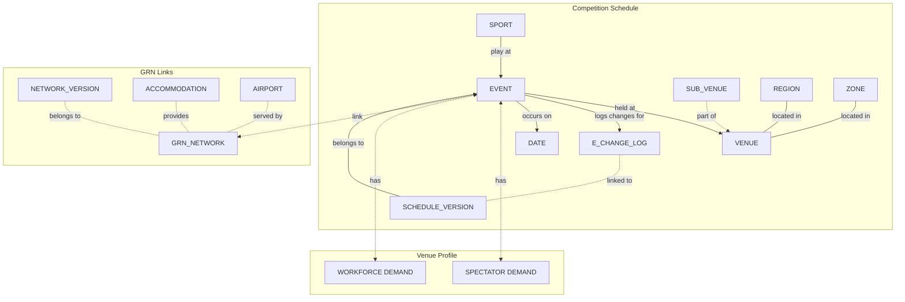
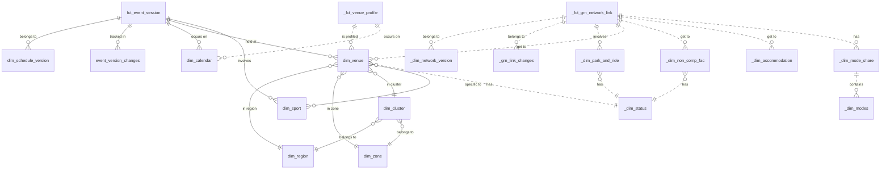

# Olympic Venue and Event Data Dimensional Modelling

## Project Overview
- Purpose: Design a data model for managing event data, including competition schedules, venues, estimated ticket sales, public transportation, park n ride sites, sports, and accommodation.
- Primary users: Planners and organizers using the data for workflows and transport modeling.
- Database system: PostgreSQL

## Key Requirements
1. Version control for competition schedules
2. Historical tracking of changes
3. Ability to handle periodic updates
4. Efficient storage of changes between versions
5. Not all dimensions change frequently, or not change at all, including sports, regions, zones, clusters. They do not need to be tracked. 
6. Dimensions that change frequently need to be tracked with SCD Type 2
7. Consider using wide table or OBT (One Big Table) if needed to save on computation and optimize query performance

## Data Model Approach
- Primary approach: Dimensional modeling with some 3NF elements
- Additional techniques: 
  - Delta storage / change data capture
  - Using ARRAY and STRUCT for OBT to optimize query performance
  - Integration of estimated ticket sales with event sessions

## Business Processes
1. Event Session Management: Tracking the creation, updating, and version control of sporting event sessions, including their schedules, venues, and estimated ticket sales.
2. Games Network Management: Maintaining and updating the games network links, including their relationship to events, athele village, accommodations, airports, park-and-ride facilities.
3. Demand Profile Management: Managing information about spectators and workforces from and to the events.

## Grains (just a few)
1. Event Session: Individual session of a sporting event, including its schedule, venue, and estimated ticket sales
   - Grain: By event, date, venue, subvenue, sport, and event type
2. Network Link: Individual link in the games transport network
   - Grain: By link ID, from node, to node, and network version
3. Demand Profiles: Individual profile option
   - Grain: By in/out figure and valid time period

## Identify the Dimensions

Based on the data provided, we can identify several dimensions:

1. Venue Dimension
2. Date Dimension
3. Sport Dimension

## Identify the Facts

The facts (measures) in this case could include:

1. Gross Seats
2. Net Seats
3. Sold Seats
4. Workforce Count

## Model Layers
1. Conceptual Model
   - High-level view of main entities: Events, Schedules, Venues, Estimated Ticket Sales, PT Network, Accommodation, Airports
   
2. Logical Model
   - Detailed entity-relationship diagram with fact and dimension tables
   - Includes SCD Type 2 for historical tracking
   
3. Physical Model
   - PostgreSQL-specific implementation
   - Includes data types, constraints, indexes, and potential optimizations

## SCD Type 2 Implementation
- Applied to fact and dimension tables where appropriate
- Additional fields: valid_from, valid_to, is_current

## Delta Storage Approach
- Store only changes between versions
- Use event_version_changes table to track modifications

## Benefits of the Model

1. `Integrated Data Management`: By combining event sessions and estimated ticket sales, the model provides a unified view of event data, simplifying queries and ensuring data consistency.
2. `Efficient Version Control`: The model supports efficient storage and retrieval of multiple schedule versions, allowing planners to track changes over time using the `dim_schedule_version` table and `version_array` in the `fct_event_session` table.
3. `Flexible Historical Analysis`: With SCD Type 2 implementation and the `event_version_changes` table, the model enables detailed historical analysis of how events and their associated data have changed over time.
4. `Scalability`: The model is designed to handle a large number of events and versions efficiently, with consideration for performance optimization through indexing and partitioning.
5. `Support for Complex Analysis`: The model facilitates complex queries and visualizations, supporting the needs of planners and organizers for detailed insights.
6. `Future-Proofing:` The inclusion of JSONB fields for additional attributes allows for future extensions without requiring structural changes to the database.
7. `Automated Change Tracking`: The track_event_changes trigger function automatically logs all changes to events, eliminating the need for manual logging and reducing the risk of human error.
8. `Efficient Delta Storage`: The `event_version_changes` table stores only the changes between versions, reducing storage requirements and improving query performance for change analysis.
9. `Flexible Querying`: The model supports various types of queries, from simple current state retrieval to complex historical analysis, through views like `current_event_sessions` and functions like `get_event_history`.
10. `Simplified Schedule Updates`: The update_to_new_schedule_version function provides a streamlined process for updating to a new schedule version, handling all necessary data manipulations in a single transaction.

 

## Conceptual Layer
 

 

## Logical Layer
 

