# Logical+Physical Layer Data Model

```mermaid
erDiagram
    staging_event_session
    fct_event_session {
        serial event_session_key
        varchar(100) hash_key
        integer schedule_version_id FK
        integer current_version_id FK
        array version_array
        integer venue_id FK
        integer sport_id FK
        integer event_type FK
        integer day_id FK
        intefer session_id
        time date_start
        time start_time
        time date_end
        time end_time
        integer gross_seats
        numeric seat_kill
        numeric est_pct_ticksold
        integer net_seats
        integer est_sold_seats
        integer workforce
        integer unticketed
        varchar(5) competition_id
        timestamp valid_from
        timestamp valid_to
        boolean is_current
        jsonb additional_attributes
    }
    dim_schedule_version {
        integer schedule_version_id PK
        varchar(50) version_code
        date valid_from
        date valid_to
    }
    event_version_changes {
        integer change_id PK
        varchar(255) event_session_id FK
        integer schedule_version_id FK
        varchar(50) change_type
        jsonb changed_fields
        jsonb previous_values
    }
    dim_calendar {
        integer day_id PK
        integer event_day
        date model_date
        date actual_date
        date day_of_week
        varchar(50) competition_type
        date valid_from
        date valid_to
        boolean is_current
    }
    dim_venues {
        integer venue_id PK
        varchar(255) venue_name
        integer status_id FK
        integer region_id FK
        integer zone_id FK
        integer cluster_id FK
        varchar(100) cluster
        numeric lattitude
        numeric longitude
        integer capacity
        geometry geometry
        date valid_from
        date valid_to
        boolean is_current
    }
    dim_subvenues {
        integer subvenue_id PK
        varchar(255) subvenue_name
        integer venue_id FK
        integer capacity
        date valid_from
        date valid_to
        boolean is_current
    }
    dim_regions {
        integer region_id PK
        varchar(100) region_name
        numeric area_sqkm
        numeric length_sqkm
        geometry geometry
    }
    dim_zones {
        integer zone_id PK
        varchar(100) zone_name
        integer region_id FK
        geometry geometry
        date valid_from
        date valid_to
        boolean is_current
    }
    dim_clusters {
        integer cluster_id PK
        varchar(100) cluster_name
        integer region_id FK
        integer zone_id FK
        date valid_from
        date valid_to
        boolean is_current
    }
    dim_sports {
        integer sport_id PK
        varchar(100) sport_discipline
        integer venue_id FK
        date valid_from
        date valid_to
        boolean is_current
    }

    dim_status {
        integer status_id PK
        varchar(50) status_name
        date valid_from
        date valid_to
        boolean is_current
    }

    staging_event_session ||-.|| fct_event_session : staged
    fct_event_session ||--o{ dim_schedule_version : "belongs to"
    fct_event_session ||--o{ event_version_changes : "tracked in"
    fct_event_session ||--o{ dim_calendar : "occurs on"
    fct_event_session ||--o{ dim_venues : "held at"
    fct_event_session ||--o{ dim_sports : "involves"
    dim_venues ||--o{ dim_subvenues : "has"
    dim_venues }o--|| dim_regions : "in region"
    dim_venues }o--|| dim_zones : "in zone"
    dim_venues }o--|| dim_clusters : "in cluster"
    dim_venues }o--|| dim_status : "has"
    dim_venues }o--o{ dim_sports : "specific to"
    dim_clusters }o--|| dim_regions : "belongs to"
    dim_clusters }o--|| dim_zones : "belongs to"

    _fct_venue_profiles {
        integer id PK
        integer schedule_version_id FK
        integer current_version_id FK
        array version_array
        integer venue_id FK
        integer day_id FK
        integer day
        time time
        numeric in
        numeric out
        varchar(5) comp_id
        date valid_from
        date valid_to
        boolean is_current
    }
    _staging_venue_profiles ||-.|| _fct_venue_profiles : "staged"
    _fct_venue_profiles ||-.o{ dim_venues : "is profiled"
    _fct_venue_profiles ||-.o{ dim_calendar : "occurs on"
    _fct_venue_profiles ||--o{ dim_schedule_version : "belongs to"
    
    _dim_non_comp_fac {
        integer nc_fac_id PK
        varchar(100) nc_fac_name
        varchar(255) description
        integer status_id FK
        integer region_id FK
        geometry geometry
        date valid_from
        date valid_to
        boolean is_current
    }
    
    _dim_non_comp_fac }o-.|| dim_status : "has"
    _dim_park_and_ride }o-.|| dim_status : "has"

    _dim_mode_share {
        int modeshare_id PK
        int venue_id FK
        int region_id FK
        int cluster_id FK
        int zone_id FK
        int main_mode_id FK
        int mode_id FK
        int spectators
        numeric mode_share
        date valid_from
        date valid_to
        boolean is_current
    }
    _dim_modes {
        int mode_id PK
        varchar(100) mode_type
        date valid_from
        date valid_to
        boolean is_current
    }
    _dim_accommodation {
        integer accommodation_key PK
        varchar(255) location_name
        integer capacity
        date valid_from
        date valid_to
        boolean is_current
    }
    _dim_park_and_ride {
        serial park_and_ride_key PK
        varchar(255) site_name
        integer capacity
        date valid_from
        date valid_to
        boolean is_current
    }
    _fct_grn_network_link {
        serial network_link_id PK
        integer network_version_id FK
        varchar(50) link_id
        varchar(50) from_node
        varchar(50) to_node
        numeric length
        varchar(50) link_type
        date valid_from
        date valid_to
        boolean is_current
    }
    _grn_link_changes{
        varchar(50) link_id FK
        integer network_version_id FK
    }
    _dim_network_version {
        serial network_version_id PK
        varchar(100) version_name
        boolean is_games_version
        date valid_from
        date valid_to
        boolean is_current
    }
    _staging_grn_network_link ||-.|| _fct_grn_network_link : "staged"
    _fct_grn_network_link ||-.o{ _dim_network_version : "belongs to"
    _fct_grn_network_link ||-.o{ _grn_link_changes : "belongs to"
    _fct_grn_network_link ||-.o{ _dim_park_and_ride : "involves"
    _fct_grn_network_link ||-.o{ dim_venue : "get to"
    _fct_grn_network_link ||-.o{ _dim_non_comp_fac : "get to"
    _fct_grn_network_link ||-.o{ _dim_accommodation : "get to"
    _fct_grn_network_link ||-.o{ _dim_mode_share : "has"
    _dim_mode_share ||-.o{ _dim_modes : "contains"
```

<br>

## Create Dimension Tables
[here](./11_create-dimension-tables.sql)
<br>

## Create Event Fact Table
[here](./12_create-event-fact-table.sql)

## Create `process_staging_event_session` Functions
[here](./13_process_staging_event_session.sql)
<br>

## Utility Functions


# Key Features

1. System now tracks all changes to events across different schedule versions using the `version_array` and `event_version_changes` table.
2. Update all current records with the new version key and append it to the version_array at the beginning of the function. This ensures that even unchanged records reflect the latest version.
3. For existing records, we append the new version to the existing version_array using array_append(`fct_event_session.version_array, new_version_id`).
4. We only update records where `is_current` = TRUE to avoid modifying historical records.
5. The handle_deleted CTE remains unchanged, as it correctly sets `is_current` = FALSE for deleted records.
6. The version_array contains all versions where a record was or is current.
7. Automatic Change Logging: The `track_event_changes` trigger function automatically logs all `inserts` and `updates` to the `fct_event_session` table, eliminating the need for manual logging.
8. Efficient Querying: Indexes on frequently used columns and views for common queries improve performance.
9. Flexibility: The `dim_schedule_version` table allows for managing multiple schedule versions, while the `get_event_history` function provides easy access to an event's history across all versions.

<br>

# FEATURES TO ADD


# WIP
```sql
CREATE TABLE dim_accommodation (
    accommodation_key SERIAL PRIMARY KEY,
    location_name VARCHAR(100) NOT NULL,
    capacity INTEGER NOT NULL,
    valid_from DATE NOT NULL,
    valid_to DATE,
    is_current BOOLEAN NOT NULL,
    CONSTRAINT accommodation_date_range CHECK (valid_to IS NULL OR valid_from < valid_to)
);

CREATE TABLE dim_park_and_ride (
    park_and_ride_key SERIAL PRIMARY KEY,
    site_name VARCHAR(100) NOT NULL,
    capacity INTEGER NOT NULL,
    valid_from DATE NOT NULL,
    valid_to DATE,
    is_current BOOLEAN NOT NULL,
    CONSTRAINT park_and_ride_date_range CHECK (valid_to IS NULL OR valid_from < valid_to)
);

CREATE TABLE dim_network_version (
    network_version_key SERIAL PRIMARY KEY,
    version_name VARCHAR(50) NOT NULL,
    is_games_version BOOLEAN NOT NULL,
    valid_from DATE NOT NULL,
    valid_to DATE,
    is_current BOOLEAN NOT NULL,
    CONSTRAINT network_version_date_range CHECK (valid_to IS NULL OR valid_from < valid_to)
);

CREATE TABLE fct_network_link (
    network_link_key SERIAL PRIMARY KEY,
    network_version_key INTEGER REFERENCES dim_network_version(network_version_key),
    link_id VARCHAR(50) NOT NULL,
    from_node VARCHAR(50) NOT NULL,
    to_node VARCHAR(50) NOT NULL,
    length DECIMAL(10,2) NOT NULL,
    link_type VARCHAR(50) NOT NULL,
    is_active BOOLEAN NOT NULL
);

CREATE INDEX idx_network_link_version ON fct_network_link(network_version_key);
```