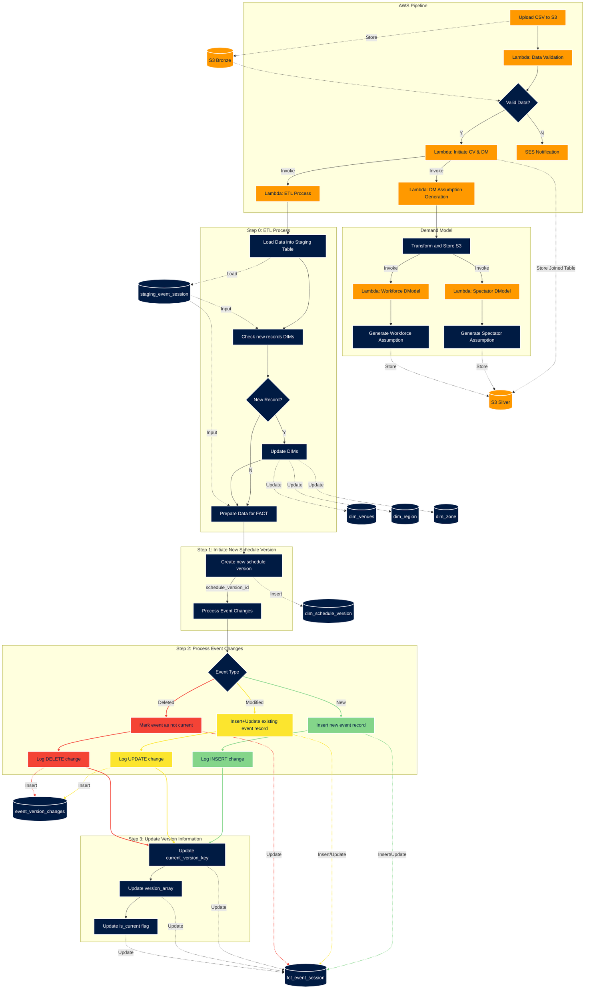

# Competition schedule version tracking dataflow

```mermaid
graph TD
    %% Color definitions
    classDef newEvent fill:#84d58a,stroke:#fff,stroke-width:2px,color:#001b43;
    classDef modifiedEvent fill:#fce52e,stroke:#fff,stroke-width:2px,color:#001b43;
    classDef deletedEvent fill:#F44336,stroke:#fff,stroke-width:2px,color:#001b43;
    classDef reintroducedEvent fill:#05c5ea,stroke:#fff,stroke-width:2px,color:#001b43;
    classDef common,decision,datastore fill:#001b43,stroke:#fff,stroke-width:2px,color:#fff;
    classDef awsService fill:#FF9900,stroke:#fff,stroke-width:2px,color:#001b43;

    %% AWS Pipeline
    subgraph "AWS Pipeline"
        CSVS3[Upload CSV to S3]
        CSVS3 --> LV[Lambda: Data Validation]
        LV --> VD{Valid Data?}
        VD --Y--> I[Lambda: Initiate CV & DM]:::awsService
        VD --N--> SN[SES Notification]:::awsService
        I --Invoke--> PS0[Lambda: ETL Process]:::awsService
        I --Invoke--> DM0
    end
        CSVS3 -.Store.-> S3B[(S3 Bronze)]
        S3B -.-> VD
        I -.Store Joined Table.-> S3S[(S3 Silver)]
    
    %% Demand Model
    subgraph "Demand Model"
        DM0[Lambda: DM Assumption Generation]:::awsService
        DM0 --> S3T[Transform and Store S3]:::common
        S3T --Invoke--> DM1[Lambda: Spectator DModel]
        DM1 --> DM3[Generate Spectator Assumption]
        S3T --Invoke--> DM2[Lambda: Workforce DModel]:::awsService
        DM2 --> DM4[Generate Workforce Assumption]
    end
        DM3 & DM4 -.Store.-> S3S

    %% Competition Schedule & Venues ETL Process
    subgraph "Step 0: ETL Process"
        PS0 --> PS1[Load Data into Staging Table]
        PS1 --> PS2[Check new records DIMs]
        PS2 --> PS3{New Record?}
        PS3 --Y--> PS4[Update DIMs]
        PS3 --N--> PS5[Prepare Data for FACT]
        PS4 ---> PS5
    end
    PS1 -.Load.-> SES[(staging_event_session)]
    SES -.Input.-> PS2 & PS5
    PS4 -.Update..-> DV[(dim_venues)] & DR[(dim_region)] & DZ[(dim_zone)]

    %% Step 1: Initiate New Schedule Version
    subgraph "Step 1: Initiate New Schedule Version"
        PS5 --> CNV[Create new schedule version]
        CNV --schedule_version_id--> PEC[Process Event Changes]
    end
    CNV -.Insert.-> SV[(dim_schedule_version)]

    %% Step 2: Process Event Changes
    subgraph "Step 2: Process Event Changes"
        PEC --> ET{Event Type}
        ET --New--> N[Insert new event record]:::newEvent
        ET --Modified--> M[Insert+Update existing event record]:::modifiedEvent
        ET --Deleted--> D[Mark event as not current]:::deletedEvent
        %% ET --> |Reintroduced| R[Insert new row for reintroduced event]:::reintroducedEvent
        N --> IN[Log INSERT change]:::newEvent
        M --> IM[Log UPDATE change]:::modifiedEvent
        D --> ID[Log DELETE change]:::deletedEvent
        %% R --> IR[Log REINTRODUCE change]:::reintroducedEvent
    end
    N & M -.Insert/Update.-> ES[(fct_event_session)]
    %% R -.-> |Insert/Update| ES[(fct_event_session)]
    D -.Update.-> ES
    IM & ID -.Insert.-> VC[(event_version_changes)]

    %% Step 3: Update Version Information
    subgraph "Step 3: Update Version Information"
        IN & IM & ID ---> UVK[Update current_version_key]
        %% IR --> UVK[Update current_version_key]
        UVK --> UVA[Update version_array]
        UVA --> UF[Update is_current flag]
    end

    %% IR -.-> |Insert| VC[(event_version_changes)]
    UVK & UVA & UF -.Update.-> ES


    %% Styling
    class CSVS3,LV,LETL,S3B,S3S,DM1,DM2,CW,RDS awsService;
    class PS1,PS2,PS3,PS4,PS5,SES,DM3,DM4,CNV,PEC,UVK,UVA,UF,SD,CF common;
    class VD,EV5,ET decision;
    class SV,ES,VC,DV,DR,DZ,SES datastore;

    %% %% Color-coded links
    linkStyle 32,35,38,43 stroke:#84d58a,stroke-width:2px;
    linkStyle 33,36,39,41,44 stroke:#fce52e,stroke-width:2px;
    linkStyle 34,37,40,42,45 stroke:#F44336,stroke-width:2px;
```