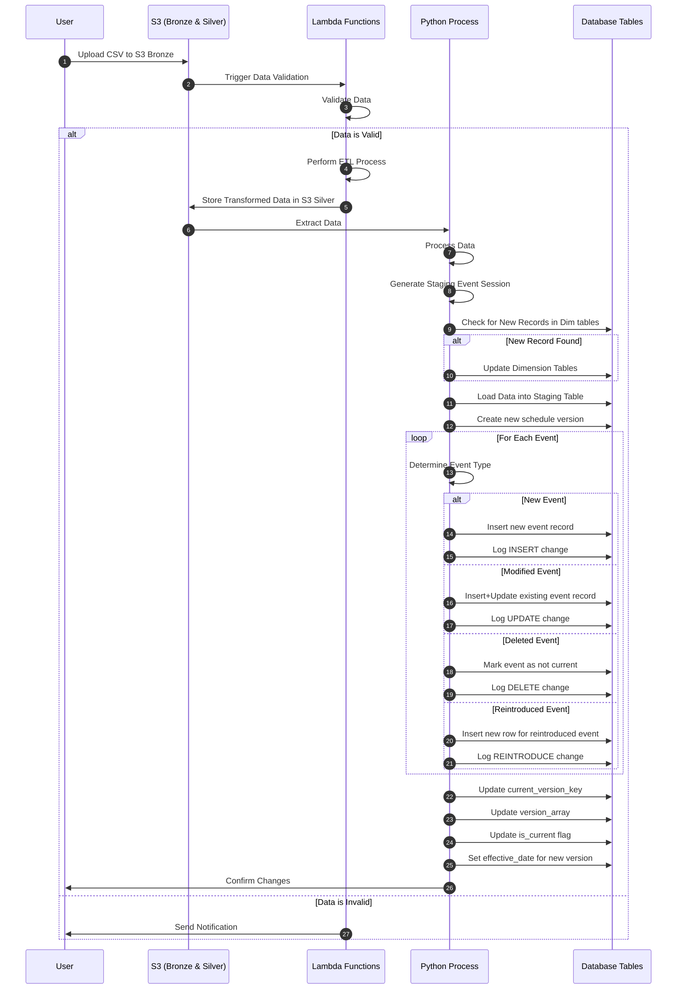

```mermaid
sequenceDiagram
    autonumber

    %% Participants
    participant User
    participant S3 as S3 (Bronze & Silver)
    participant Lambda as Lambda Functions
    participant Python as Python Process
    participant DB as Database Tables

    %% User Actions
    User->>S3: Upload CSV to S3 Bronze
    S3->>Lambda: Trigger Data Validation

    %% Data Validation
    Lambda->>Lambda: Validate Data
    alt Data is Valid
        Lambda->>Lambda: Perform ETL Process
        Lambda->>S3: Store Transformed Data in S3 Silver
        S3->>Python: Extract Data
        Python->>Python: Process Data
        Python->>Python: Generate Staging Event Session
        Python->>DB: Check for New Records in Dim tables
        alt New Record Found
            Python->>DB: Update Dimension Tables
        end
        Python->>DB: Load Data into Staging Table
        Python->>DB: Create new schedule version
        loop For Each Event
            Python->>Python: Determine Event Type
            alt New Event
                Python->>DB: Insert new event record
                Python->>DB: Log INSERT change
            else Modified Event
                Python->>DB: Insert+Update existing event record
                Python->>DB: Log UPDATE change
            else Deleted Event
                Python->>DB: Mark event as not current
                Python->>DB: Log DELETE change
            else Reintroduced Event
                Python->>DB: Insert new row for reintroduced event
                Python->>DB: Log REINTRODUCE change
            end
        end
        Python->>DB: Update current_version_key
        Python->>DB: Update version_array
        Python->>DB: Update is_current flag
        Python->>DB: Set effective_date for new version
        Python->>User: Confirm Changes
    else Data is Invalid
        Lambda->>User: Send Notification
    end
```