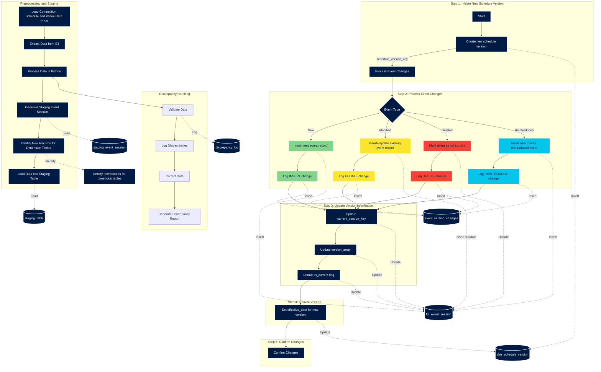

Handling data discrepancies is a critical part of the ETL process to ensure data quality and consistency. Here are detailed steps to handle data discrepancies in your workflow:

Steps for Handling Data Discrepancies
Data Validation:

Validate the raw data before processing to identify any discrepancies.
Use validation rules to check for missing values, incorrect data types, and out-of-range values.
Logging Discrepancies:

Log any discrepancies found during validation for further analysis.
Store logs in a dedicated table in the database for audit purposes.
Data Correction:

Apply correction rules to fix common data discrepancies.
If automatic correction is not possible, flag the records for manual review.
Discrepancy Reporting:

Generate reports on data discrepancies to monitor and improve data quality over time.
Detailed Implementation Steps
Step 1: Data Validation
In the preprocessing step in Python, add validation checks:

```python
def validate_data(df):
    discrepancies = []

    for index, row in df.iterrows():
        if pd.isnull(row['Sport_Discipline']):
            discrepancies.append((index, 'Sport_Discipline', 'Missing value'))
        if pd.isnull(row['Venue+SubVenue']):
            discrepancies.append((index, 'Venue+SubVenue', 'Missing value'))
        if not isinstance(row['Day'], int):
            discrepancies.append((index, 'Day', 'Incorrect data type'))
        if row['Net_Seats'] < 0 or row['Sold_Seats'] < 0:
            discrepancies.append((index, 'Net_Seats/Sold_Seats', 'Out of range value'))
    
    return discrepancies

# Apply validation to the normalized event table
discrepancies = validate_data(normalized_event_table)
# Step 2: Logging Discrepancies. Store the discrepancies in a log table:

discrepancy_log = pd.DataFrame(discrepancies, columns=['Index', 'Column', 'Issue'])

# Insert discrepancy log into PostgreSQL
def insert_discrepancy_log(df, table_name):
    df.to_sql(table_name, engine, if_exists='append', index=False)

insert_discrepancy_log(discrepancy_log, 'discrepancy_log')
# Step 3: Data Correction. Apply correction rules or flag records for manual review:

def correct_data(df):
    # Example correction: Fill missing 'Sport_Discipline' with 'Unknown'
    df['Sport_Discipline'].fillna('Unknown', inplace=True)
    
    # Example flagging: Create a new column to flag rows with discrepancies
    df['Flagged_for_review'] = False
    for index, column, issue in discrepancies:
        df.at[index, 'Flagged_for_review'] = True

# Apply correction to the normalized event table
correct_data(normalized_event_table)

# Step 4: Discrepancy Reporting. Generate reports on data discrepancies:

# Example: Count discrepancies by column
discrepancy_report = discrepancy_log['Column'].value_counts()

print(discrepancy_report)
```

Updated Data Flow Diagram with Discrepancy Handling

<br>

Explanation of the Added Steps
Discrepancy Handling:

DH1: Validate the data to identify any discrepancies.
DH2: Log the discrepancies into a discrepancy log table.
DH3: Apply data correction rules or flag records for manual review.
DH4: Generate a discrepancy report to monitor and improve data quality over time.
Data Flow Connections:

PS3: After processing data in Python, validate the data (DH1).
DH1: Log any discrepancies found during validation to the discrepancy