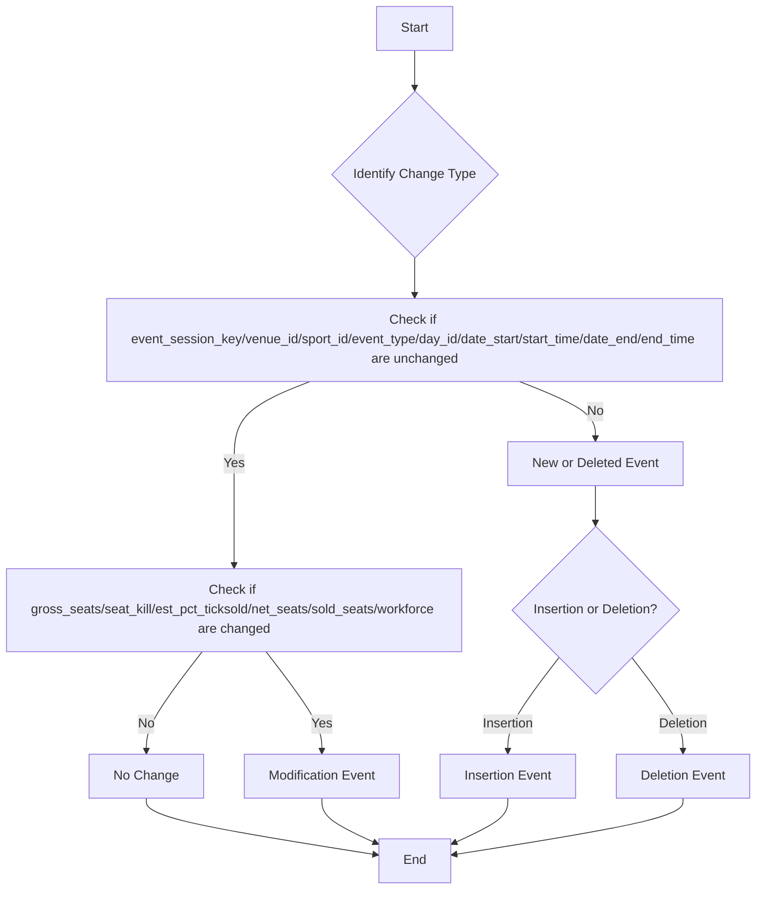

# Event Type Decision Flow

 

# Competition Schedule Version Tracking Example

This document demonstrates the state of `dim_schedule_version`, `fct_event_session`, and `event_version_changes` tables after each update, covering four versions with scenarios for initial insert, modification, deletion, insertion of new records, and reintroduction of previously modified/deleted events.

## Initial State (Version 1)
Version 1: Initial insert of three events (E1, E2, E3)

### dim_schedule_version

| schedule_version_id | version_number | valid_from     | valid_to            |
| ------------------- | -------------- | -------------- | ------------------- |
| 1                   | V1             | [V1 timestamp] | 9999-12-31 23:59:59 |

### fct_event_session

| event_session_id | hashkey                          | schedule_version_id | venue_id | sport_id | event_type | day_id | date_start | start_time | date_end   | end_time | gross_seats | seat_kill | est_pct_ticksold | net_seats | sold_seats | workforce | valid_from     | valid_to            | is_current | version_array | current_version_id |
| ---------------- | -------------------------------- | ------------------- | -------- | -------- | ---------- | ------ | ---------- | ---------- | ---------- | -------- | ----------- | --------- | ---------------- | --------- | ---------- | --------- | -------------- | ------------------- | ---------- | ------------- | ------------------ |
| 1                | 5f3a7854c8fa617f88d06f7c616d269e | 1                   | 101      | 201      | 301        | 1      | 2024-07-26 | 09:00:00   | 2024-07-26 | 11:00:00 | 60000       | 1000      | 0.8              | 59000     | 47200      | 500       | [V1 timestamp] | 9999-12-31 23:59:59 | true       | [1]           | 1                  |
| 2                | 7b91f906b09bf8f3c084fe9f7edb4a10 | 1                   | 102      | 202      | 302        | 1      | 2024-07-26 | 14:00:00   | 2024-07-26 | 16:00:00 | 10000       | 200       | 0.9              | 9800      | 8820       | 100       | [V1 timestamp] | 9999-12-31 23:59:59 | true       | [1]           | 1                  |
| 3                | 9f6f7b1cbb1b563f64f0e9fe18961baa | 1                   | 103      | 203      | 303        | 2      | 2024-07-27 | 10:00:00   | 2024-07-27 | 12:00:00 | 5000        | 100       | 0.75             | 4900      | 3675       | 50        | [V1 timestamp] | 9999-12-31 23:59:59 | true       | [1]           | 1                  |

### event_version_changes

| change_id | hashkey                          | schedule_version_id | change_type | changed_fields |
| --------- | -------------------------------- | ------------------- | ----------- | -------------- |
| 1         | 5f3a7854c8fa617f88d06f7c616d269e | 1                   | INSERT      | null           |
| 2         | 7b91f906b09bf8f3c084fe9f7edb4a10 | 1                   | INSERT      | null           |
| 3         | 9f6f7b1cbb1b563f64f0e9fe18961baa | 1                   | INSERT      | null           |

## Version 2 (Modification)
Version 2: Modification of one event (E2's end time and estimated percentage of tickets sold)

### dim_schedule_version

| schedule_version_id | version_number | valid_from     | valid_to            |
| ------------------- | -------------- | -------------- | ------------------- |
| 1                   | V1             | [V1 timestamp] | [V2 timestamp]      |
| 2                   | V2             | [V2 timestamp] | 9999-12-31 23:59:59 |

### fct_event_session

| event_session_id | hashkey                          | schedule_version_id | venue_id | sport_id | event_type | day_id | date_start | start_time | date_end   | end_time | gross_seats | seat_kill | est_pct_ticksold | net_seats | sold_seats | workforce | valid_from     | valid_to            | is_current | version_array | current_version_id |
| ---------------- | -------------------------------- | ------------------- | -------- | -------- | ---------- | ------ | ---------- | ---------- | ---------- | -------- | ----------- | --------- | ---------------- | --------- | ---------- | --------- | -------------- | ------------------- | ---------- | ------------- | ------------------ |
| 1                | 5f3a7854c8fa617f88d06f7c616d269e | 1                   | 101      | 201      | 301        | 1      | 2024-07-26 | 09:00:00   | 2024-07-26 | 11:00:00 | 60000       | 1000      | 0.8              | 59000     | 47200      | 500       | [V1 timestamp] | 9999-12-31 23:59:59 | true       | [1,2]         | 2                  |
| 2                | 7b91f906b09bf8f3c084fe9f7edb4a10 | 1                   | 102      | 202      | 302        | 1      | 2024-07-26 | 14:00:00   | 2024-07-26 | 16:00:00 | 10000       | 200       | 0.9              | 9800      | 8820       | 100       | [V1 timestamp] | [V2 timestamp]      | false      | [1]           | 2                  |
| 3                | 9f6f7b1cbb1b563f64f0e9fe18961baa | 1                   | 103      | 203      | 303        | 2      | 2024-07-27 | 10:00:00   | 2024-07-27 | 12:00:00 | 5000        | 100       | 0.75             | 4900      | 3675       | 50        | [V1 timestamp] | 9999-12-31 23:59:59 | true       | [1,2]         | 2                  |
| 4                | 7b91f906b09bf8f3c084fe9f7edb4a10 | 2                   | 102      | 202      | 302        | 1      | 2024-07-26 | 14:00:00   | 2024-07-26 | 17:00:00 | 10000       | 200       | 0.95             | 9800      | 9310       | 100       | [V2 timestamp] | 9999-12-31 23:59:59 | true       | [2]           | 2                  |

### event_version_changes

| change_id | hashkey                          | schedule_version_id | change_type | changed_fields                                                         |
| --------- | -------------------------------- | ------------------- | ----------- | ---------------------------------------------------------------------- |
| 1         | 5f3a7854c8fa617f88d06f7c616d269e | 1                   | INSERT      | null                                                                   |
| 2         | 7b91f906b09bf8f3c084fe9f7edb4a10 | 1                   | INSERT      | null                                                                   |
| 3         | 9f6f7b1cbb1b563f64f0e9fe18961baa | 1                   | INSERT      | null                                                                   |
| 4         | 7b91f906b09bf8f3c084fe9f7edb4a10 | 2                   | UPDATE      | {"end_time": "17:00:00", "est_pct_ticksold": 0.95, "sold_seats": 9310} |

## Version 3 (Deletion and Insertion)
Version 3: Deletion of one event (E3) and insertion of a new event (E4)

### dim_schedule_version

| schedule_version_id | version_number | valid_from     | valid_to            |
| ------------------- | -------------- | -------------- | ------------------- |
| 1                   | V1             | [V1 timestamp] | [V2 timestamp]      |
| 2                   | V2             | [V2 timestamp] | [V3 timestamp]      |
| 3                   | V3             | [V3 timestamp] | 9999-12-31 23:59:59 |

### fct_event_session

| event_session_id | hashkey                          | schedule_version_id | venue_id | sport_id | event_type | day_id | date_start | start_time | date_end   | end_time | gross_seats | seat_kill | est_pct_ticksold | net_seats | sold_seats | workforce | valid_from     | valid_to            | is_current | version_array | current_version_id |
| ---------------- | -------------------------------- | ------------------- | -------- | -------- | ---------- | ------ | ---------- | ---------- | ---------- | -------- | ----------- | --------- | ---------------- | --------- | ---------- | --------- | -------------- | ------------------- | ---------- | ------------- | ------------------ |
| 1                | 5f3a7854c8fa617f88d06f7c616d269e | 1                   | 101      | 201      | 301        | 1      | 2024-07-26 | 09:00:00   | 2024-07-26 | 11:00:00 | 60000       | 1000      | 0.8              | 59000     | 47200      | 500       | [V1 timestamp] | 9999-12-31 23:59:59 | true       | [1,2,3]       | 3                  |
| 2                | 7b91f906b09bf8f3c084fe9f7edb4a10 | 1                   | 102      | 202      | 302        | 1      | 2024-07-26 | 14:00:00   | 2024-07-26 | 16:00:00 | 10000       | 200       | 0.9              | 9800      | 8820       | 100       | [V1 timestamp] | [V2 timestamp]      | false      | [1]           | 3                  |
| 3                | 9f6f7b1cbb1b563f64f0e9fe18961baa | 1                   | 103      | 203      | 303        | 2      | 2024-07-27 | 10:00:00   | 2024-07-27 | 12:00:00 | 5000        | 100       | 0.75             | 4900      | 3675       | 50        | [V1 timestamp] | 9999-12-31 23:59:59 | false      | [1,2]         | 3                  |
| 4                | 7b91f906b09bf8f3c084fe9f7edb4a10 | 2                   | 102      | 202      | 302        | 1      | 2024-07-26 | 14:00:00   | 2024-07-26 | 17:00:00 | 10000       | 200       | 0.95             | 9800      | 9310       | 100       | [V2 timestamp] | 9999-12-31 23:59:59 | true       | [2,3]         | 3                  |
| 5                | 3d2e8f1c7b5a4e9d6c8f2a1b3e7d9c0a | 3                   | 104      | 204      | 304        | 3      | 2024-07-28 | 13:00:00   | 2024-07-28 | 15:00:00 | 15000       | 300       | 0.7              | 14700     | 10290      | 150       | [V3 timestamp] | 9999-12-31 23:59:59 | true       | [3]           | 3                  |

### event_version_changes

| change_id | hashkey                          | schedule_version_id | change_type | changed_fields                                                         |
| --------- | -------------------------------- | ------------------- | ----------- | ---------------------------------------------------------------------- |
| 1         | 5f3a7854c8fa617f88d06f7c616d269e | 1                   | INSERT      | null                                                                   |
| 2         | 7b91f906b09bf8f3c084fe9f7edb4a10 | 1                   | INSERT      | null                                                                   |
| 3         | 9f6f7b1cbb1b563f64f0e9fe18961baa | 1                   | INSERT      | null                                                                   |
| 4         | 6f7a21cbc08f9c35f9a5e9c6d1d0f8b2 | 2                   | UPDATE      | {"end_time": "17:00:00", "est_pct_ticksold": 0.95, "sold_seats": 9310} |
| 5         | 9f6f7b1cbb1b563f64f0e9fe18961baa | 3                   | DELETE      | null                                                                   |
| 6         | 3d2e8f1c7b5a4e9d6c8f2a1b3e7d9c0a | 3                   | INSERT      | null                                                                   |

## Version 4 (Reintroduction of Previously Modified/Deleted Event)
Version 4: Reintroduction of E3 (previously deleted) with modified details. Reinstatement of E2 (previously modified in Version 2) with original details from Version 1

### dim_schedule_version

| schedule_version_id | version_number | valid_from     | valid_to            |
| ------------------- | -------------- | -------------- | ------------------- |
| 1                   | V1             | [V1 timestamp] | [V2 timestamp]      |
| 2                   | V2             | [V2 timestamp] | [V3 timestamp]      |
| 3                   | V3             | [V3 timestamp] | [V4 timestamp]      |
| 4                   | V4             | [V4 timestamp] | 9999-12-31 23:59:59 |

### fct_event_session

| event_session_id | hashkey                          | schedule_version_id | venue_id | sport_id | event_type | day_id | date_start | start_time | date_end   | end_time | gross_seats | seat_kill | est_pct_ticksold | net_seats | sold_seats | workforce | valid_from     | valid_to            | is_current | version_array | current_version_id |
| ---------------- | -------------------------------- | ------------------- | -------- | -------- | ---------- | ------ | ---------- | ---------- | ---------- | -------- | ----------- | --------- | ---------------- | --------- | ---------- | --------- | -------------- | ------------------- | ---------- | ------------- | ------------------ |
| 1                | 5f3a7854c8fa617f88d06f7c616d269e | 1                   | 101      | 201      | 301        | 1      | 2024-07-26 | 09:00:00   | 2024-07-26 | 11:00:00 | 60000       | 1000      | 0.8              | 59000     | 47200      | 500       | [V1 timestamp] | 9999-12-31 23:59:59 | true       | [1,2,3,4]     | 4                  |
| 2                | 7b91f906b09bf8f3c084fe9f7edb4a10 | 1                   | 102      | 202      | 302        | 1      | 2024-07-26 | 14:00:00   | 2024-07-26 | 16:00:00 | 10000       | 200       | 0.9              | 9800      | 8820       | 100       | [V1 timestamp] | [V2 timestamp]      | false      | [1]           | 4                  |
| 3                | 9f6f7b1cbb1b563f64f0e9fe18961baa | 1                   | 103      | 203      | 303        | 2      | 2024-07-27 | 10:00:00   | 2024-07-27 | 12:00:00 | 5000        | 100       | 0.75             | 4900      | 3675       | 50        | [V1 timestamp] | 9999-12-31 23:59:59 | false      | [1,2]         | 4                  |
| 4                | 7b91f906b09bf8f3c084fe9f7edb4a10 | 2                   | 102      | 202      | 302        | 1      | 2024-07-26 | 14:00:00   | 2024-07-26 | 17:00:00 | 10000       | 200       | 0.95             | 9800      | 9310       | 100       | [V2 timestamp] | 9999-12-31 23:59:59 | false      | [2,3]         | 4                  |
| 5                | 3d2e8f1c7b5a4e9d6c8f2a1b3e7d9c0a | 3                   | 104      | 204      | 304        | 3      | 2024-07-28 | 13:00:00   | 2024-07-28 | 15:00:00 | 15000       | 300       | 0.7              | 14700     | 10290      | 150       | [V3 timestamp] | 9999-12-31 23:59:59 | true       | [3,4]         | 4                  |
| 6                | 9f6f7b1cbb1b563f64f0e9fe18961baa | 4                   | 103      | 203      | 303        | 2      | 2024-07-27 | 10:00:00   | 2024-07-27 | 12:00:00 | 5000        | 100       | 0.75             | 4900      | 3675       | 50        | [V4 timestamp] | 9999-12-31 23:59:59 | true       | [4]           | 4                  |
| 7                | 7b91f906b09bf8f3c084fe9f7edb4a10 | 4                   | 102      | 202      | 302        | 1      | 2024-07-26 | 14:00:00   | 2024-07-26 | 16:00:00 | 10000       | 200       | 0.9              | 9800      | 8820       | 100       | [V4 timestamp] | 9999-12-31 23:59:59 | true       | [4]           | 4                  |

### event_version_changes

| change_id | hashkey                          | schedule_version_id | change_type | changed_fields                                                          |
| --------- | -------------------------------- | ------------------- | ----------- | ----------------------------------------------------------------------- |
| 1         | 5f3a7854c8fa617f88d06f7c616d269e | 1                   | INSERT      | null                                                                    |
| 2         | 7b91f906b09bf8f3c084fe9f7edb4a10 | 1                   | INSERT      | null                                                                    |
| 3         | 9f6f7b1cbb1b563f64f0e9fe18961baa | 1                   | INSERT      | null                                                                    |
| 4         | 6f7a21cbc08f9c35f9a5e9c6d1d0f8b2 | 2                   | UPDATE      | {""end_time": "17:00:00", "est_pct_ticksold": 0.95, "sold_seats": 9310} |
| 5         | 9f6f7b1cbb1b563f64f0e9fe18961baa | 3                   | DELETE      | null                                                                    |
| 6         | 3d2e8f1c7b5a4e9d6c8f2a1b3e7d9c0a | 3                   | INSERT      | null                                                                    |
| 7         | 9f6f7b1cbb1b563f64f0e9fe18961baa | 4                   | INSERT      | null                                                                    |
| 8         | 7b91f906b09bf8f3c084fe9f7edb4a10 | 4                   | INSERT      | null                                                                    |

## Key points to note:

1. `schedule_version_key` remains constant for each record, indicating the version when the record was first created.
2. `current_version_key` is updated to the latest version number for all current records in each new version.
3. The `version_array` contains all versions where a record was or is current, including the current version.
4. `is_current` is a boolean flag indicating whether the record is current in the latest version.
5. When a record is modified, its `valid_from` is updated to the current timestamp, and the `version_array` is appended with the new version.
6. Deleted records (like E3 in Version 3) retain their last current version in the `version_array` and have `is_current` set to false.
7. New records (like E4 in Version 3) start with only the current version in their `version_array` and have their `schedule_version_key` set to the version they were created in.

This structure allows for efficient querying of the current state while maintaining a full history of changes across versions. You can easily query current records using `WHERE is_current = TRUE`, and the `version_array` allows for efficient querying of records as they existed in any specific version.
